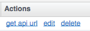
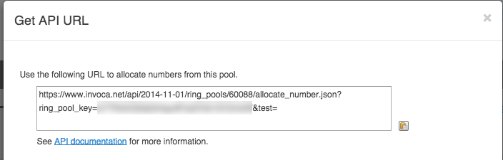

Ringpool
========

The RingPool API allocates a dynamic, trackable promo phone number from a RingPool. A valid call to the RingPool API returns a promo number and a formatted click-through URL.

Example API URL:

``https://<NETWORK>.invoca.net/api/@@NETWORK_API_VERSION/ring_pools/16/allocate_number.xml?ring_pool_key=<KEY>&site=<VALUE1>&location=<VALUE2>``

<NETWORK>.invoca.net is the vanity URL for your platform. Note that your platform may exist on invoca.net or ringrevenue.com, and both are supported.

<RingPool_ID> is a unique identifier for the RingPool.

<KEY> is the RingPool key, which is provided through the RingPool wizard UI on the platform and should be kept a secret. The parameters are explained in detail below in the “API Parameters” section.

The parameter names should match those chosen in the RingPool wizard, or you can use generic parameter names “param1”, “param2”, etc. Here is the same API URL with the generic parameter names:

``https://<NETWORK>.invoca.net/api/@@NETWORK_API_VERSION/ring_pools/16/allocate_number.xml?ring_pool_key=<KEY>&param1=<VALUE1>&param2=<VALUE2>``

**Note:** To access the campaign RingPool’s API URL navigate to the Campaign Summary’s RingPool tab and click “get api url” under Actions.

.. raw:: html

   

Response Formats
----------------

The response can be in any of these formats: **xml**, **json** or **csv**. To choose the format, change the “.xml” shown in the URL to “.json” or “.csv”. Below are example responses for each format:

**xml**

.. code-block:: xml

  <?xml version="1.0" encoding="UTF-8"?>
  <Response>
    <PromoNumberFormatted>888-390-6665</PromoNumberFormatted>
    <PromoNumber>8883906665</PromoNumber>
    <TrackingUrl> https://invoca.net/c/1/14-11-109?us=http%3A%2F%2Fwww2.invoca.net%2Fdemo%2F8x8_staging.html%3Fsid%3D8883906665%26PPCPN%3D8883906665</TrackingUrl>
  </Response>

**json**

.. code-block:: json

  {"promo_number_formatted":"888-390-6665","tracking_url":" https://invoca.net/c/1/14-11-109?us=http%3A%2F%2Fwww2.invoca.net.com%2Fdemo%2F8x8_staging.html%3Fsid%3D8883906665%26PPCPN%3D8883906665","promo_number":"8883906665"}

**csv**

.. code-block:: text

  PromoNumberFormatted,PromoNumber,TrackingUrl
  888-390-6665,8883906665, https://invoca.net/c/1/14-11-109?us=http%3A%2F%2Fwww2.invoca.net%2Fdemo%2F8x8_staging.html%3Fsid%3D8883906665%26PPCPN%3D8883906665

As an advertiser, you can allocate promo numbers from your RingPool on behalf of your affiliates in order to credit them for calls. Just include an affiliate id in the query string of the API URL. Note that the parameter name depends on your network and the value must match what is set on the affiliate account. Here is an example URL for tracking affiliate 5567 on a network that calls the affiliate id a pid:

``https://<NETWORK>.invoca.net/api/@@NETWORK_API_VERSION/ring_pools/16/allocate_number.xml?ring_pool_key=<KEY>&pid=5567&sid=adwords``

Errors
------

The RingPool API clearly identifies errors when a request can not be processed. If the number pool is exhausted, the API still succeeds because an overflow number is returned. If a parameter is not passed correctly, an XML error response is returned as shown below:

.. code-block:: xml

  <?xml version="1.0" encoding="UTF-8"?>
  <Error>
    <Class>InvalidKey</Class>
    <Message>API Key 'A329F4DC002168' is not valid for resource '1'</Message>
  </Error>

Or for json or csv, the following text is returned:

`InvalidKey: API Key 'A329F4DC002168' is not valid for resource '1'`

If a system error occurs, an InternalServiceError is returned in XML (or simple text for json or csv) with an integer error handle. Contact questions@invoca.com to determine the root cause of the error.

RingPool Types
--------------

All 6 RingPool types are supported by the API:

Custom

Custom + Search keywords

Search Engine + Keywords

Search Engine + Keyword ID

Referral Domains

Referral Domains + search

API Parameters
""""""""""""""

The API supports the following parameters:

.. list-table::
  :widths: 11 40
  :header-rows: 1
  :class: parameters

  * - Parameter
    - Description

  * - ring_pool_key=
    - The required authentication key unique for each RingPool.

  * - param1=
    - [Custom RingPools only] The first custom parameter of a Custom RingPool. This parameter can also be represented by the custom name.

  * - param2=
    - [Custom RingPools only] The second custom parameter of a Custom RingPool.

  * - …
    -

  * - param10=
    - [Custom RingPools only] The 10th custom parameter of a Custom RingPool.

  * - search_engine=
    - [All Search RingPool types] The search engine name used to process the search query.

  * - search_keywords=
    - [All Search RingPool types] The search query that the user searched for.

  * - search_keyword_id=
    - [Keyword ID Search RingPool only] The keyword ID that is associated to the query string.

  * - landing_page=
    - [Optional] The landing page URL to be shown in reporting.

  * - referrer=
    - [All Referral Domain types, otherwise Optional] Can be used instead of search_engine= and search_keyword. Those values will be inferred by parsing the referrer URL. Referral Domains + search will use referrer as the Traffic Source if either the search_engine or search_keywords are omitted.

  * - mobile_click_to_call=
    - [Optional] Option to return mobile enabled links that populate the smartphone’s dialer when clicked.

  * - <NETWORK_AFFILIATE_ID_NAME>
    - [Optional] This parameter name is determined by the network and is used to allocate a promo number on behalf of the publisher. For example, pid=2341

Endpoint:

``https://invoca.net/api/@@NETWORK_API_VERSION/ring_pools/16/allocate_number.xml?ring_pool_key=<KEY>&param1=<VALUE1>&param2=<VALUE2>``

Local RingPool API
------------------

Local RingPool Creation
"""""""""""""""""""""""

The API provides the ability to create RingPools with additional information that specifies them as being ‘Local’ RingPools. These Local RingPools use local numbers that are determined by the parameters passed in by the user of the API. If a local phone number cannot be found the pool fills those slots (max_pool_size) with toll free numbers instead. When you POST with the correct parameters the Local RingPool is created and the allocation of local numbers happens later (approx. 10 minutes). This capability is JSON-only.

POST
~~~~

``https://invoca.net/api/@@NETWORK_API_VERSION/<network_id>/advertiser/<advertiser_id_from_network>/advertiser_campaign/<advertiser_campaign_id_from_network>/ring_pools/<desired_id_from_network>.json``

Content Type: application/json

.. list-table::
  :widths: 11 8 40
  :header-rows: 1
  :class: parameters

  * - Property
    - Type
    - Value

  * - name
    - string
    - Arbitrary string. Names the RingPool.

  * - pool_type
    - string (Required)
    - One of:

      Search,

      SearchKeyword,

      Custom,

      CustomWithSearchTracking,

      ReferallDomain,

      ReferallDomainWithSearchTracking

  * - destination_type
    - string (Required)
    - For affiliate campaign, one of:

      Advertiser,

      Affiliate,

      API

      For advertiser campaign, one of:

      Advertiser,

      API

  * - destination_url
    - url
    - like, https://www.invoca.com

  * - affiliate_id
    - string (optional)
    - if specified, an affiliate campaign will be the target, o.w. advertiser campaign is the target

  * - lifetime_seconds
    - integer
    - The guaranteed minimum time that the number will be allocated for this RingPool

  * - max_pool_size
    - integer
    - The maximum amount of phone numbers to be allotted at one time

  * - param1
    - string
    - Dynamic number pools have attributes named param1 through param10 for custom use by the user

  * - preferred
    - boolean
    - true or false.  Selects this RingPool if the advertiser has multiple RingPools for the campaign and the web integration code does not specifiy which pool to use.

  * - test_click_url
    - string
    - RingPool tracking link.

  * - sample_api_url
    - string
    - RingPool API endpoint.

  * - is_first_preference
    - boolean
    - Designates the preferred RingPool to be used for general traffic.

  * - local_center
    - hash
    - Requires one of the following

      Latitude & Longitude required together

      A filled field determines the center to start looking for local numbers at.

      **“tn_prefix”**: can be either npa or npa or npa-nxx

      **“zipcode”**: a valid zipcode

      **“latitude”**: a valid latitude

      **“longitude”**: a valid longitude

  * - tn_prefix_whitelist
    - array of strings
    - an array of stringified limiters on the boundaries of where to look for local numbers given as npa or npa nxx pairs (ex. [“805”, “805612”])

Response Code: 200

**Request Body**

.. code-block:: json

  {
   "param1": "gclid",
   "pool_type": "Custom",
   "preferred": "true",
   "name": "India DNP",
   "destination_url": "https://www.invoca.com",
   "tracking_url": "https://www.invoca.com",
   "max_pool_size": "3",
   "destination_type": "Advertiser",
   "local_center": {“latitude”: 45, “longitude”: 45},
   "tn_prefix_whitelist": ["455"]}
  }

**Response Body**

.. code-block:: json

  {}

Error Handling
""""""""""""""

Forbidden – 403:

POST
~~~~

``https://invoca.net/api/@@NETWORK_API_VERSION/<network_id>/advertiser/<advertiser_id_from_network>/advertiser_campaign/<advertiser_campaign_id_from_network>/ring_pools/<desired_id_from_network>.json``

Content Type: application/json

Response Code: 403

**Request Body**

.. code-block:: json

  {
    "param1": "gclid",
    "pool_type": "Custom",
    "preferred": "true",
    "name": "India DNP",
    "destination_url": "https://www.invoca.com",
    "tracking_url": "https://www.invoca.com",
    "max_pool_size": "3",
    "destination_type": "Advertiser",
    "local_center": {“bad_key”: “”},
    "tn_prefix_whitelist": ["455"]}
  }

**Response Body**

.. code-block:: json

  {
    "errors": {
         "class": "RecordInvalid”,
       "invalid_data": "Invalid Key in Local Center."
    }
  }
